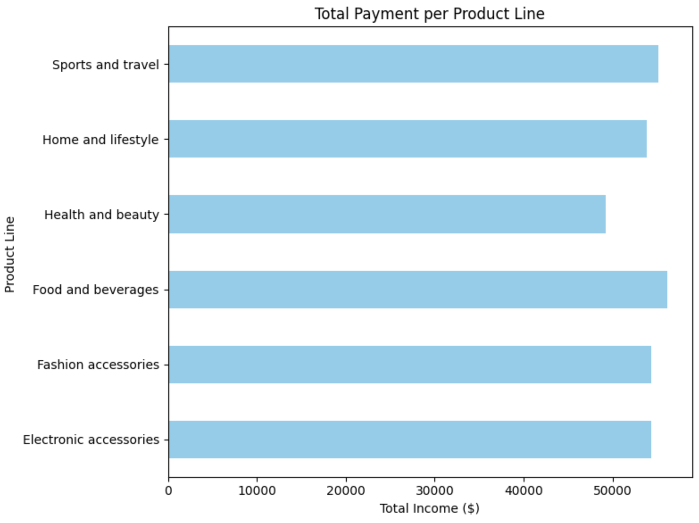

# Introduction
This work was part of 2024 ESAP's (Engineering Summer At Penn) final project on data processing, cleaning, and visualization. The investigation's subjects were data analysis on supermarket data and its implications on maximizing revenues and profits for businesses through relevant policying.

## Technical Information
The data used can be found through the "Data" folder, and the data processing and visualization was done through Python using NumPy and Pandas libraries for data cleaning and processing, and matplotlib for visualization.

## Results and Interpretation

a) More stock during peak months -- discounts for buying in stock, no need to store stock during offpeak

b) hire more staff during peak, less during offpeak

c) have more seasonal items (fall months have more sales)

a) More/less employees in specific hours

b) Store's active hours may be adjusted accordingly

a) Discounts for members

b) Member exclusive deals, encourage those who spend more, to spend even more.

c) Special perks for members such as faster checkout, or delivery service for groceries.

a) More expensive items should be very high quality, those who buy it are left happy.

b) Less deals on higher priced items, people dont mind spending more.

c) Create a paid - VIP experience for shoppers, higher spenders have a better shopping experience.

a) Discount offers for bigger purchases

b) Cash-back for members in store credit to insentivise making bigger purchases at this store instead of buying in fragments.
      
c) Have express checkout lane in peak purchasing hours to encourage smaller purchases as-well.

a) Higher quality and more expensive products for females -- they appreciate the quality and don't mind spending.

b) Cheaper products for male oriented products, -- they would rather have less quality and spend a bit less.

c) Deal for higher qualtity male targeted products, the deal makes them beleive their saving money and getting higher quality products.

a) Special deals on specific days such as Thursday
      
b) Less/more employees in specific days according to activity

a) Higher prices foods and beverages which are also higher quality
        
b) Deals on health and beauty products -- allowing people to get good products for less
        
c) Staff tech experts for the tech area encouraging customers to buy higher quality products and pay more.

